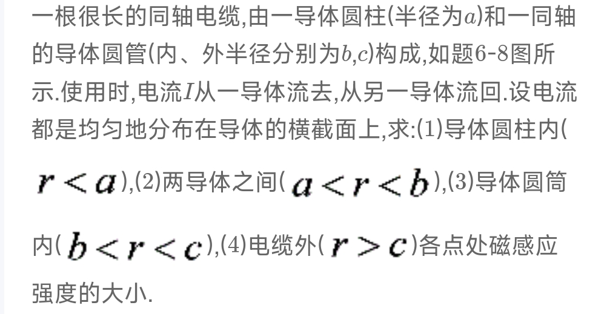

# 大物下

[toc]

## 电磁学

### 静电场

**库仑定律：**

$F=\frac{1}{4Πɛ_0} *\frac{Qq}{r^2}$ 

$矢量表达式：F=\frac{1}{4Πɛ_0} *\frac{Qq}{r^2}r_0$ 

场强定义：$E = \frac{F}{q}$

**电通量**

**高斯定理**

1. 

   #### 分析：

   > 

   #### 参考答案：

   

   ---

2. 

   #### 分析：

   

   #### 参考答案：

   

   ---

3. 

   #### 分析：

   

   #### 参考答案：

   

   ---

4. 

   #### 分析：

   #### 参考答案：

   

   ---

5. 

   #### 分析：

   #### 参考答案：

   

   ---

6. 

   #### 分析：

   #### 参考答案：

   

   ---

### 稳恒磁场

**毕奥-萨法尔定律**

$B(r) = \frac{μ_0}{4Π}*\frac{Qv}{r^2}xr_0$

$B(r) = \frac{μ_0}{4Π}*\frac{Idl}{r^2}xr_0$ 

**无限长直导线在距离a处任意一点产生的磁感应强度**

$B=\frac{μ_0I}{2Πa}$

**有限长载流直导线在距离a处某点产生的磁感应强度**

$B_p = \frac{μ_0I}{4Πa}(cosα-cosβ)$ 

**磁通量**

1. 

   #### 分析：

   #### 参考答案：

   

   ---

2. 

   #### 分析：

   #### 参考答案：

   

   ---

3. 

   #### 分析：

   #### 参考答案：

   

   ---

4. 

   #### 分析：

   #### 参考答案：

   

   ---

5. 

   #### 分析：

   #### 参考答案：

   

   ---

6. 

   #### 分析：

   #### 参考答案：

   

   ---

7. 

   #### 分析：

   #### 参考答案：

   

   ---

8. 

   #### 分析：

   #### 参考答案：

   

   ---

9. 

   #### 分析：

   #### 参考答案：

   

   ---

   

### 变化的电磁场

1. 

   #### 分析：

   

   #### 参考答案：

   

   ---

## 波动光学

### 光的干涉

1. 

   #### 分析：

   #### 参考答案：

   

   ---

2. 

   #### 分析：

   #### 参考答案：

   

   ---

3. 

   #### 分析：

   #### 参考答案：

   

   ---

4. 

   #### 分析：

   #### 参考答案：

   

   ---

5. 

   #### 分析：

   #### 参考答案：

   

   ---

6. 

   #### 分析：

   #### 参考答案：

   

   ---

   

### 光的衍射

1. 

   #### 分析：

   

   #### 参考答案：

   

   ---

2. 

   #### 分析：

   #### 参考答案：

   

   ---

3. 

   #### 分析：

   #### 参考答案：

   

   ---

4. 

   #### 分析：

   #### 参考答案：

   

   ---

5. 

   #### 分析：

   #### 参考答案：

   

   ---

