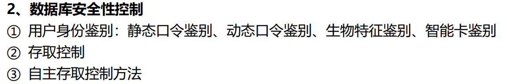
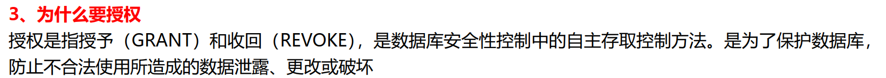
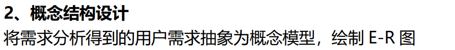

# 数据库

> 选择填空一般出自
>
> 绪论、数据库安全性、数据库完整性、数据库设计、数据库编程、数据库恢复技术、并发控制

[toc]

## 绪论

1. 

2. 

3. 

4. 

5. 

   

6. 

7. 

## 关系数据库

## 关系数据库标准语言SQL

## 数据库安全性

1. 

2. 

3. 

4. 

5. 

6. 

7. 

8. 

9. 

10. 

    

## 数据库完整性

1. 

2. 

3. 

   

   

   

   

## 关系数据库理论

## 数据库设计

1. 
2. 
3. 
4. 
5. 
6. 

## 数据库编程

1. 

## 关系查询处理和查询优化

## 数据库恢复技术

1. 
2. 
3. 
4. 

## 并发控制
