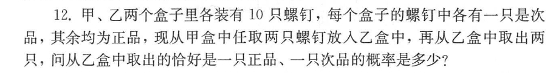

# 概率论

[toc]

## 知识点及对应题目

### 第一章

> 随机事件的概率

1. 

   #### 分析：

   > 1. 首先这件事情是连续的（也就是从甲取出的螺丝钉会对乙取出螺丝钉的最终结果产生影响）
   > 2. 可以分情况讨论（从甲中取出的两个都是正品，从甲中取出的有一个次品）
   > 3. 在这两种情况的基础上去分析乙中螺丝钉的情况
   > 4. 使用加法原理，对两种情况的概率相加
   >
   > **情况一：**
   >
   > 从甲中取出的全是正品 $\frac{C_{9}^{2}}{C_{10}^{2}}$ ，在这个前提下，从乙中取出的恰好一只正品，一只次品的概率
   >
   > $\frac{C_{11}^{1}·C_1^1}{C_{12}^{2}}$ 
   >
   > **情况二：**
   >
   > 从甲中取出一个正品一个次品 $\frac{C_9^1·C_1^1}{C_{10}^{2}}$ ，在这个前提下，从乙中取出的恰好一只正品，一只次品的概率
   >
   > $\frac{C_{10}^{1}·C_2^1}{C_{12}^{2}}$ 
   >
   > 使用加法原理：
   >
   > $P = \frac{C_{9}^{2}}{C_{10}^{2}} · \frac{C_{11}^{1}·C_1^1}{C_{12}^{2}} + \frac{C_9^1·C_1^1}{C_{10}^{2}} ·\frac{C_{10}^{1}·C_2^1}{C_{12}^{2}}$
   >
   > ==组合数的计算方法==
   >
   > 
   >
   > **简化方法**
   >
   > $\frac{C_{9}^{2}}{C_{10}^{2}} = \frac{\frac{9*8}{2*1}}{\frac{10*9}{2*1}} = \frac{9*8}{10*9} = \frac{4}{5}$ 
   >
   > **答案：**
   >
   > $\frac{4}{5}* \frac{1}{6} + \frac{1}{5}* \frac{10}{33}$
   >
   > ==其实这不是我想要的解法，使用这种方法，我虽然能够解开题目，但是我非常难受，因我我感觉这非常的繁琐，不够优雅==
   >
   > 我总是倾向于把问题复杂化，我时常想把握当下所有的事情，把所有的可能都算出来，我希望交给下一步的不是假设，而是已经计算好的概率，虽然这很愚蠢，但这不是一个人的偏执。
   >
   > 分析问题：
   >
   > 从甲中取出的螺丝钉有一个次品的概率，上面已经计算过，为$\frac{1}{5}$，所以乙里面有$\frac{6}{5}$ 个次品，$\frac{54}{5}$ 个，从中取出一个正品，一个次品的概率

   #### 参考答案

    

2. 

3. 

4. 

### 第二章

> 随机变量及其分布

### 第三章

> 多维随机变量及其分布

### 第四章

> 随机变量的数字特征

### 第五章

> 数理统计的基础知识

### 第六章

> 参数估计

### 第七章

> 假设检验

### 第八章

> 方差分析与回归分析

### 往年题目

1. 

2. 

3. 

4. 

5. 

6. 

    

7. 

8. 

9. 

10. 

11. 

12. 

13. 

14. 

15. 

16. 

17. 

