# 概率论

[toc]

## 知识点及对应题目

### 第一章

> 随机事件的概率

1. 

   #### 分析：条件概率

   > 1. 首先这件事情是连续的（也就是从甲取出的螺丝钉会对乙取出螺丝钉的最终结果产生影响）
   > 2. 可以分情况讨论（从甲中取出的两个都是正品，从甲中取出的有一个次品）
   > 3. 在这两种情况的基础上去分析乙中螺丝钉的情况
   > 4. 使用加法原理，对两种情况的概率相加
   >
   > **情况一：**
   >
   > 从甲中取出的全是正品 $\frac{C_{9}^{2}}{C_{10}^{2}}$ ，在这个前提下，从乙中取出的恰好一只正品，一只次品的概率
   >
   > $\frac{C_{11}^{1}·C_1^1}{C_{12}^{2}}$ 
   >
   > **情况二：**
   >
   > 从甲中取出一个正品一个次品 $\frac{C_9^1·C_1^1}{C_{10}^{2}}$ ，在这个前提下，从乙中取出的恰好一只正品，一只次品的概率
   >
   > $\frac{C_{10}^{1}·C_2^1}{C_{12}^{2}}$ 
   >
   > 使用加法原理：
   >
   > $P = \frac{C_{9}^{2}}{C_{10}^{2}} · \frac{C_{11}^{1}·C_1^1}{C_{12}^{2}} + \frac{C_9^1·C_1^1}{C_{10}^{2}} ·\frac{C_{10}^{1}·C_2^1}{C_{12}^{2}}$
   >
   > ==组合数的计算方法==
   >
   > 
   >
   > **简化方法**
   >
   > $\frac{C_{9}^{2}}{C_{10}^{2}} = \frac{\frac{9*8}{2*1}}{\frac{10*9}{2*1}} = \frac{9*8}{10*9} = \frac{4}{5}$ 
   >
   > **答案：**
   >
   > $\frac{4}{5}* \frac{1}{6} + \frac{1}{5}* \frac{10}{33}$
   >
   > ==其实这不是我想要的解法，使用这种方法，我虽然能够解开题目，但是我非常难受，因我我感觉这非常的繁琐，不够优雅==
   >
   > 我总是倾向于把问题复杂化，我时常想把握当下所有的事情，把所有的可能都算出来，我希望交给下一步的不是假设，而是已经计算好的概率，虽然这很愚蠢，但这不是一个人的偏执。
   >
   > 分析问题：
   >
   > 从甲中取出的螺丝钉有一个次品的概率，上面已经计算过，为$\frac{1}{5}$，所以乙里面有$\frac{6}{5}$ 个次品，$\frac{54}{5}$ 个，从中取出一个正品，一个次品的概率

   #### 参考答案：

   

   ---

    

2. 

   #### 分析：独立事件

   > 1. 两人都中靶
   >
   >    0.8*0.7= 0.56
   >
   > 2. 甲中乙不中
   >
   >    0.8*0.3 = 0.24
   >
   > 3. 甲不中乙中
   >
   >    0.2*0.7 =0.14

   #### 参考答案：

   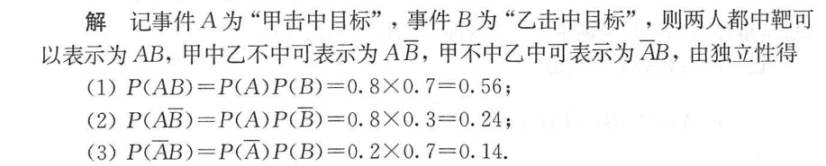

   ---

   

3. 

   #### 分析：

   > **对第一种工序进行分析：**
   >
   > 1. 合格率 0.9 * 0.8 *0.7 = 0.504
   > 2. 得到一级品的概率 0.504*0.9 = 0.4536
   >
   > **对第二种工序进行分析：**
   >
   > 1. 得到合格品的概率 0.7*0.7 = 0.49
   > 2. 得到一级品的概率 0.49*0.8 = 0.392

   #### 参考答案：

   

   ---

   

4. 

   #### 分析：

   > 1. 求机床因无人照看而停工的概率，但是现在只有一个工人， 所以也就是求需要有两台或以上的机床需要照看的概率
   >
   > 2. 分情况讨论，两台机床需要照看的概率，三台机床需要照看的概率，或者讨论它的反面，一台机床需要照看，或者没有机床需要照看的概率，然后用总概率减去
   >
   >    - 都不需要照看的概率
   >
   >      $0.9*0.8*0.85 = 0.612$
   >
   >    - 一台需要照看的概率
   >
   >      $(0.1*0.8*0.85)+(0.9*0.2*0.85)+(0.9*0.8*0.15) = 0.329$
   >
   >    - 两台需要照看的概率（讨论哪一台不需要被照看）
   >
   >      $(0.9*0.2*0.15)+(0.1*0.8*0.15)+(0.1*0.2*0.85) = 0.056$
   >
   >    - 三台需要照看的概率
   >
   >      $0.1*0.2*0.15 = 0.003$
   >
   > 3. 答案使用加法
   >
   >    0.056 + 0.003 = 0.059
   >
   >    

   #### 参考答案：

   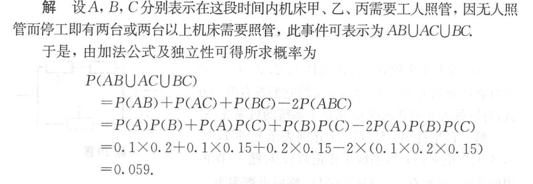

   ---

   

### 第二章

> 随机变量及其分布

二项分布与超几何分布

> 二项分布，结果分成两类
>
> 超几何分布，样本分为两类

泊松分布：

> 当二项分布的 $n ≥ 100 并且 np ≤ 10$ 

正态分布：

> 一般正态分布
>
> 标准正态分布
>
> 密度函数和分布函数

一般正态分布转标准正态分布：

密度函数：

分布函数：

1. 

   #### 分析：

   > 离散型，直接往里带，注意端点取值
   >
   > 随机变量$\frac{1}{2}<X<\frac{5}{2}$ 所以 $X = 2 或 X = 3$
   >
   > 同理：
   >
   > (2) $X = 1 或 X = 2 或 X = 3$
   >
   > (3) $X = 4 或 X = 5$
   >
   > 使用概率函数分别求出对应的概率，然后累加
   
   #### 参考答案：
   
   
   
   ---

2. 

   #### 分析：

   > 1. $X 只可能 等于3，4，5 中一个$
   >
   >    - 取出 3
   >
   >      $\frac{C_3^3}{C_5^3}$ ($C_3^3$ 表示只能取1，2，3)
   >
   >    - 取出 4 
   >
   >      $\frac{C_3^2*1}{C_5^3}$ 
   >
   >    - 取出 5
   >
   >      $\frac{C_4^2}{C_5^3}$ 

   #### 参考答案：

   

   ---

   

3. 

   #### 分析：

   > 1. 从当生产过程中出现废品时理解进行调整，可知，这是一个超几何分布
   > 2. 求$X$的概率分布，也就是讨论在第X次时生产不合格品的概论
   > 3. $P\{X = k\} = (1-p)^kp$
   >
   > **如何区分二项分布和几何分布**
   >
   > > 
   > >
   > > 与二项分布关心的“n次实验k次成功的概率”不同，几何分布关心的是，**事件发生（或者实验）n次中，在第x次取得成功的概率**。其发生的概率P为：
   > >
   > > 
   
   #### 参考答案：
   
   
   
   ---

4. 

   #### 分析：

   > 1. 通过给出的分布函数，很容易得出 $X$ 的概率分布（不用写计算过程，其实就是两间断点之间的落差）
   >
   > 2. 求解条件概率
   >
   > 3. $P(A|B) = \frac{P(AB)}{P(B)}$ 
   >
   >    >  电子版为了避免转义字符，所以用了小括号，其实都可以，但是书上用的大括号
   >
   >    $P(X ≠ 1) = 0.6$
   >
   >    $P(X<2 并且 X 不≠ -1) = P(X = 1) = 0.4$ 
   
   #### 参考答案：
   
   
   
   ---

5. 

   #### 分析：

   > 1. 这道题考察分布函数和密度函数
   >
   > 2. 根据定义
   >
   >    P{0.4 < X ≤ 1.3} = F(1.3) - F(0.4) = 0.6
   >
   >    同理可得下面的
   
   #### 参考答案：
   
   
   
   ---

6. 

   #### 分析：

   > 1. 求系数用两个已知条件
   >
   >    1. F(-∞) = 0
   >
   >       $A + B * (-\frac{Π}{2}) = 0$ 
   >
   >    2. F(+∞) = 1
   >
   >       $A + B * (\frac{Π}{2}) = 1$ 
   >
   >       所以 $A = \frac{1}{2}、 B = \frac{1}{Π}$
   >
   > 2. 也就是求，$P\{-1 < X ≤ 1\} = F(1) - F(-1) = \frac{1}{2}$ 

   #### 参考答案：

   

   ---

   

7. 

   #### 分析：

   > 1. 连续型随机变量$X$ （在整个定义域连续，离散型右连续）
   >
   > 2. 求系数
   >
   >    1. $F(-∞) = 0$
   >
   >       当然成立
   >
   >    2. $F(+∞) = 1$
   >
   >       $F(+∞) = A = 1$
   >
   >       $F(0) = 0, B = -1$
   >
   > 3. $P(-1 < X <1) = F(1) - F(-1) = F(1) = 1-e^{-2}$
   >
   > 4. $f(x) = F^`(X) = 2e^{-2x} (x>0)$ 
   
   #### 参考答案：
   
   
   
   ---

8. 

   #### 分析：

   > 1. 先求一个150小时不需要更换的概率
   >
   >    概率密度函数求定积分可以得到概率分布函数
   >
   >    **下面给出基本初等函数的导数公式**
   >
   >    > 求积分
   >    >
   >    > 1. 常数可以提到积分外面
   >    > 2. d后面可以加常数
   >
   >    
   
   #### 参考答案：
   
   
   
   ---

9. 

   #### 分析：

   > 1. 正态分布 $μ = 0， σ = 10$ 不是标准正态分布
   >
   > 求一次误差超过19.6的概率
   >
   > $P\{|X|>19.6\} = P\{X < -19.6 || X>19.6\} = $ (发现不好做)
   >
   > $P\{|X|>19.6\} = 1-P\{|X|≤19.6\} = 1 - P\{-19.6 ≤ X ≤ 19.6\}$
   >
   > 转换为标准正态分布$1 - P\{-19.6 ≤ X ≤ 19.6\} = 1-P\{-1.96≤ \frac{X}{10} ≤ 1.96\}$ 
   >
   > 利用正太分布的分布函数的性质，通过**查表**可以算出
   >
   > 一次误差超过19.6 的概率 P = 0.05
   >
   > 然后问题转换为二项分布，最终通过泊松分布近似得出结果

   ####  参考答案：

   

   ---

10. 

    #### 分析：

    > 指数分布
    >
    > 
    >
    > 
    >
    > 根据指数分布的公式，可知
    >
    > $F(x) = 1 - e^{-\frac{x}{5}}$ 
    >
    > ==这题的n太小，所以不能用泊松分布来近似二项分布==

    #### 参考答案：

    

    ---

11. 

    #### 分析：

    > 1. $F(X) = 1-e^{-\frac{x}{600}}$ 
    > 2. 对每个电子元件而言，200小时内不损坏的概率为 $e^{-\frac{1}{3}}$ 
    > 3. 对题意，取反面，三只都不损坏的概率 $(e^{-\frac{1}{3}})^3$
    > 4. 所以至少有一个电子元件损坏的概率 $1-\frac{1}{e}$ 

    #### 参考答案：

    

    ---

12. 

    #### 分析：

    > 由分布函数求密度函数
    >
    > 正态分布函数
    >
    > 

    #### 参考答案：

    

    ---

13. 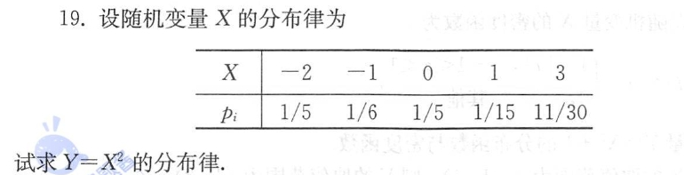

    #### 分析：

    > 由分布律求分布律
    >
    > 离散型随机变量，直接写
    >
    > 记得去重，不要留小号

    #### 参考答案：

    

    ---

14. 

    #### 分析：

    > 由密度分布函数求换元后的密度分布函数
    >
    > 使用原变量表示换元后的变量

    #### 参考答案：

    

    ---

### 第三章

> 多维随机变量及其分布

1. 

   #### 分析：

   > 将符合情况的加在一起

   #### 参考答案：

   

   ---

   

2. 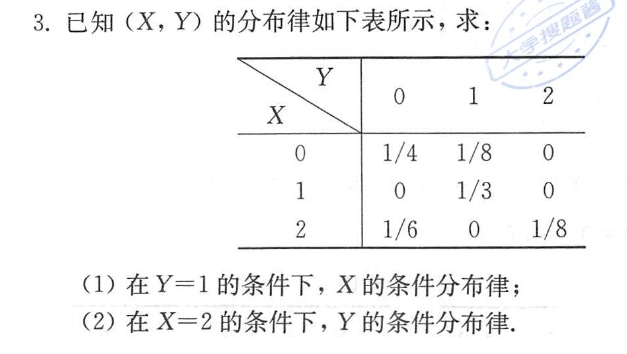

   #### 分析：

   > 1. 先求出随机变量 $X和Y$ 的边缘分布
   > 2. 然后使用条件概率公式进行求解

   #### 参考答案：

   

   ---

   

3. 

   #### 分析：

   > 1. 已知密度函数，求边缘密度函数
   >
   >    > 求谁就对另一个变量进行积分
   >    >
   >    > $f_Y(y) = ∫_{-∞}^{+∞}f(x,y)dx = ∫_{0}^{1}f(x,y)dx = \frac{3}{2}x^2|_0^1$ 
   >    >
   >    > 但是因为求 $Y$ 变量的边缘密度函数，所以要用积分上下限要用 $y$ 表示 $x$ 
   >    >
   >    > $0<x<1，0<y<x \ \ \ \Rightarrow y<x<1$ 
   >    >
   >    > 原积分式：
   >    >
   >    > $f_Y(y) = \frac{3}{2}x^2|_y^1$ 
   >
   > 2. 条件概率

   #### 参考答案：

   

   ---

   

4. 

   #### 分析：

   > 1. 首先得知 两个参数相互独立
   >
   >    > 所以可以得知，联合密度 = 两边缘密度的乘积
   >    >
   >    > 对于离散型的
   >    >
   >    > 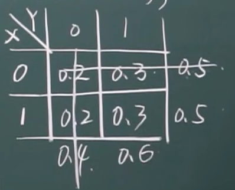
   >    >
   >    > 对于连续型
   >    >
   >    > 

   #### 参考答案：

   

   ---

   

5. 

   #### 分析：

   > 1. 先求出 $X$ 的密度函数
   >
   > 2. 又因为两变量相互独立，求出联合密度函数
   >
   > 3. 求此人能及时上火车的概率
   >
   >    也就是求，$Y>X$ 的概率 $P\{X<Y\} $
   >
   >    $0≤y≤5 \ 所以 \ 0≤x≤y$ 
   >
   >    

   #### 参考答案：

   

   ----

6. 

   #### 分析：

   > 二维随机变量函数分布
   >
   > 

   #### 参考答案：

   

   ---

7. 

   #### 分析：

   > 0 1 分布

   #### 参考答案：

   

   ----

8. 

   #### 分析：

   > 1. 第一步判断是否独立
   >
   >    分别求出 $随机变量\ X \ 和 \ 随机变量 \ Y \ $ 的边缘分布
   >
   >    然后检验两个边缘密度函数的乘积是否等于联合密度函数
   >
   > 2. 根据连续型随机变量的卷积公式求出概率密度（使用卷积公式的前提——讨论$Z = X+Y$） 

   #### 参考答案：

   

   ---

9. 

   #### 分析：

   > 1. 求常数，利用分布函数的 $F(+∞) = 1 $ 的特性
   > 2. 求边缘概率密度直接对另一个变量求积分
   > 3. 因为是max所以不用讨论情况

   #### 参考答案：
   
   
   
   

### 第四章

> 随机变量的数字特征

1. 

   #### 分析：

   > 数学期望
   >
   > 

   #### 参考答案：

   

   ---

2. 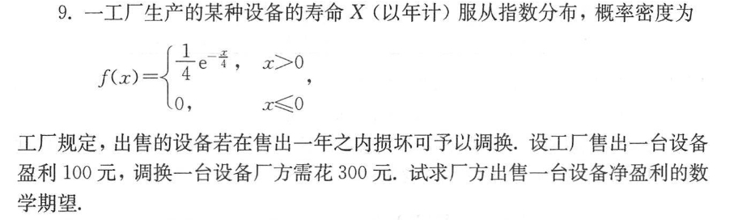

   #### 分析：

   > 1. 要求净利润期望，先找净利润函数
   >
   >    这是一个指数分布

   #### 参考答案：

   

   ---

3. 

   #### 分析：

   > 

   #### 参考答案：

   

   ----

4. 

   #### 分析：

   > 多维随机变量的数学期望
   >
   > **数学期望的性质**
   >
   > 1. 常数的期望等于常数
   > 2. $E(X+C) = E(X)+C$ 可以由 1 推导出来
   > 3. $E(CX) = CE(X)$ 
   > 4. $E(kX+b) = kE(X) + b $ 
   > 5. $E(X±Y) = E(X)±E(Y)$ (不需要考虑随机变量的独立性)
   > 6. $当随机变量 \ X 、\ Y\ 独立时，E(XY) = E(X)*E(Y)$ 

   #### 参考答案：

   

   

   ---

5. 

   #### 分析：

   > 根据概率密度方程求期望

   #### 参考答案：

   

   ---

6. 

   #### 分析：

   > 1. 期望
   >
   > 2. 方差
   >
   >    
   >
   >    
   >
   >    

   #### 参考答案：

   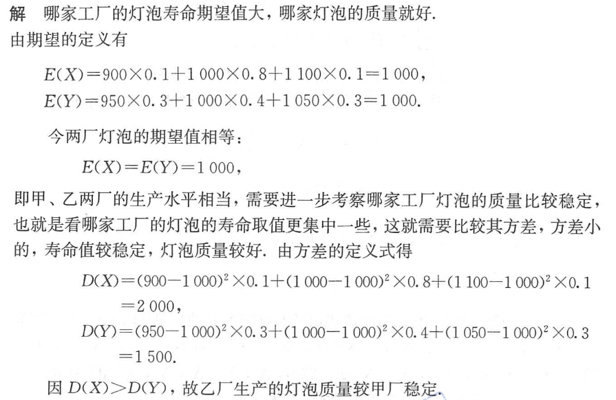

   ---

7. 

   #### 分析：

   >  X属于二项分布
   >
   > 如果
   >
   > 
   >
   > Y属于泊松分布
   >
   > 

   #### 参考答案：

   

   ---

8. 

   #### 分析：

   > 因为相互独立
   >
   > 1. $E(Y) = 2E(X_1) - E(X_2)+3E(X_3)-\frac{1}{2}E(X_4)$ 
   > 2. $D(Y) = 2^2D(X_1) + D(X_2)+3^2D(X_3)+\frac{1}{2}^2D(X_4)$

   #### 参考答案：

   

   ---

9. 

   #### 分析：

   > 

   #### 参考答案：

   

   ---

10. 

    #### 分析：

    > 

    #### 参考答案：

    

    ---

11. 

    #### 分析：

    > 

    #### 参考答案：

    

    ---

12. 

    #### 分析：

    > 

    #### 参考答案：

    

    ---

13. 

    #### 分析：

    > 

    #### 参考答案：

    

    ---

14. 

       #### 分析：

    > 

       #### 参考答案：

       

    ----

15. 

    #### 分析：

    > 

    #### 参考答案：

    

    ---

16. 

    #### 分析：

    > 

    #### 参考答案：

    

    ---

17. 

    #### 分析：

    > 

    #### 参考答案：

    

    ---
    
    

### 第五章

> 数理统计的基础知识

1. 

   #### 分析：

   > 

   #### 参考答案：

   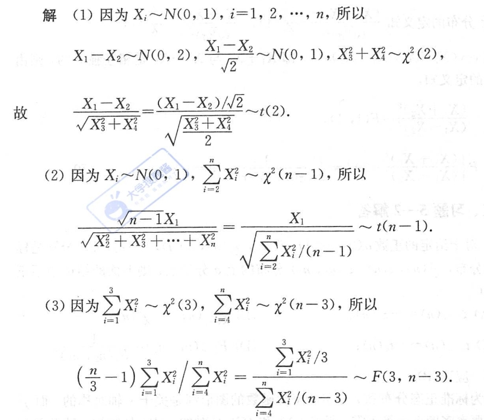

   ---

2. 

   #### 分析：

   > 

   #### 参考答案：

   

   ---

3. 

   #### 分析：

   > 

   #### 参考答案：

   

   ---

4. 

   #### 分析：

   > 

   #### 参考答案：

   

   ---

5. 

   #### 分析：

   > 

   #### 参考答案：

   

   ---

6. 

   #### 分析：

   > 

   #### 参考答案：

   

   ---

   

### 第六章

> 参数估计

1. 

   #### 分析：

   > 

   #### 参考答案：

   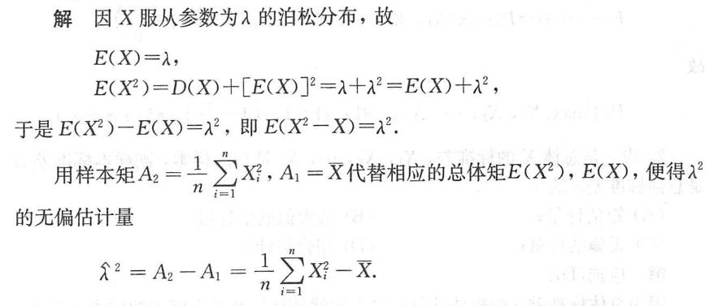

   ---

2. 

   #### 分析：

   > 

   #### 参考答案：

   

   ---

   

## 往年题目

1. 

   #### 分析：

   > 可以考虑反面
   >
   > $1-(\overline{A}\cap\overline{B}\cap\overline{C})$ 

   #### 参考答案：

   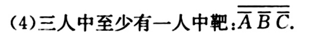

   ---

2. 

   #### 分析：

   > 1. 因为$A\cup B = \frac{1}{2} < \frac{7}{12}$ 所以A，B不独立
   > 2. $P(AB) = P(A)+P(B)-P(A\cup B) = \frac{1}{12}$  

   #### 参考答案： 

   

   ---

3. 

   #### 分析：

   > 1. 分情况讨论
   >
   >    1. 全是白球
   >
   >       $\frac{C_3^2}{C_5^2}$
   >
   >    2. 全是黑球
   >
   >       $\frac{C_2^2}{C_5^2}$ 
   >
   > 2. 讨论反面，两个球不同
   >
   >    $1-\frac{C_3^1*C_2^1}{C_5^2} = 0.4$

   #### 参考答案：

   

   ---

4. 

   #### 分析：

   > 

   #### 参考答案：

   

   ---

5. 

   #### 分析：

   > 

   #### 参考答案：

   

   ---

6. 

    

   #### 分析：

   > 

   #### 参考答案：

   

   ---

7. 

   #### 分析：

   > 

   #### 参考答案：

   

   ---

8. 

   #### 分析：

   > 

   #### 参考答案：

   

   ---

9. 

   #### 分析：

   > 

   #### 参考答案：

   

   ---

10. 

    #### 分析：

    > 

    #### 参考答案：

    

    ---

11. 

    #### 分析：

    > 

    #### 参考答案：

    

    ---

12. 

    #### 分析：

    > 

    #### 参考答案：

    

    ---

13. 

    #### 分析：

    > 

    #### 参考答案：

    

    ---

14. 

    #### 分析：

    > 

    #### 参考答案：

    

    ---

15. 

    #### 分析：

    > 

    #### 参考答案：

    

    ---

16. 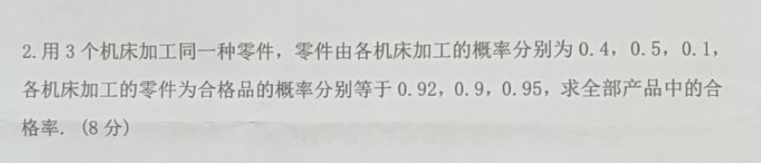

    #### 分析：

    > 

    #### 参考答案：

    

    ---

17. 

    #### 分析：

    > 

    #### 参考答案：

    

    ---

