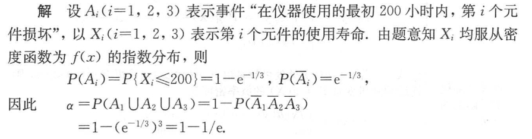

# 概率论

[toc]

## 知识点及对应题目

### 第一章

> 随机事件的概率

1. 

   #### 分析：条件概率

   > 1. 首先这件事情是连续的（也就是从甲取出的螺丝钉会对乙取出螺丝钉的最终结果产生影响）
   > 2. 可以分情况讨论（从甲中取出的两个都是正品，从甲中取出的有一个次品）
   > 3. 在这两种情况的基础上去分析乙中螺丝钉的情况
   > 4. 使用加法原理，对两种情况的概率相加
   >
   > **情况一：**
   >
   > 从甲中取出的全是正品 $\frac{C_{9}^{2}}{C_{10}^{2}}$ ，在这个前提下，从乙中取出的恰好一只正品，一只次品的概率
   >
   > $\frac{C_{11}^{1}·C_1^1}{C_{12}^{2}}$ 
   >
   > **情况二：**
   >
   > 从甲中取出一个正品一个次品 $\frac{C_9^1·C_1^1}{C_{10}^{2}}$ ，在这个前提下，从乙中取出的恰好一只正品，一只次品的概率
   >
   > $\frac{C_{10}^{1}·C_2^1}{C_{12}^{2}}$ 
   >
   > 使用加法原理：
   >
   > $P = \frac{C_{9}^{2}}{C_{10}^{2}} · \frac{C_{11}^{1}·C_1^1}{C_{12}^{2}} + \frac{C_9^1·C_1^1}{C_{10}^{2}} ·\frac{C_{10}^{1}·C_2^1}{C_{12}^{2}}$
   >
   > ==组合数的计算方法==
   >
   > 
   >
   > **简化方法**
   >
   > $\frac{C_{9}^{2}}{C_{10}^{2}} = \frac{\frac{9*8}{2*1}}{\frac{10*9}{2*1}} = \frac{9*8}{10*9} = \frac{4}{5}$ 
   >
   > **答案：**
   >
   > $\frac{4}{5}* \frac{1}{6} + \frac{1}{5}* \frac{10}{33}$
   >
   > ==其实这不是我想要的解法，使用这种方法，我虽然能够解开题目，但是我非常难受，因我我感觉这非常的繁琐，不够优雅==
   >
   > 我总是倾向于把问题复杂化，我时常想把握当下所有的事情，把所有的可能都算出来，我希望交给下一步的不是假设，而是已经计算好的概率，虽然这很愚蠢，但这不是一个人的偏执。
   >
   > 分析问题：
   >
   > 从甲中取出的螺丝钉有一个次品的概率，上面已经计算过，为$\frac{1}{5}$，所以乙里面有$\frac{6}{5}$ 个次品，$\frac{54}{5}$ 个，从中取出一个正品，一个次品的概率

   #### 参考答案：

   

   ---

    

2. 

   #### 分析：独立事件

   > 1. 两人都中靶
   >
   >    0.8*0.7= 0.56
   >
   > 2. 甲中乙不中
   >
   >    0.8*0.3 = 0.24
   >
   > 3. 甲不中乙中
   >
   >    0.2*0.7 =0.14

   #### 参考答案：

   

   ---

   

3. 

   #### 分析：

   > **对第一种工序进行分析：**
   >
   > 1. 合格率 0.9 * 0.8 *0.7 = 0.504
   > 2. 得到一级品的概率 0.504*0.9 = 0.4536
   >
   > **对第二种工序进行分析：**
   >
   > 1. 得到合格品的概率 0.7*0.7 = 0.49
   > 2. 得到一级品的概率 0.49*0.8 = 0.392

   #### 参考答案：

   

   ---

   

4. 

   #### 分析：

   > 1. 求机床因无人照看而停工的概率，但是现在只有一个工人， 所以也就是求需要有两台或以上的机床需要照看的概率
   >
   > 2. 分情况讨论，两台机床需要照看的概率，三台机床需要照看的概率，或者讨论它的反面，一台机床需要照看，或者没有机床需要照看的概率，然后用总概率减去
   >
   >    - 都不需要照看的概率
   >
   >      $0.9*0.8*0.85 = 0.612$
   >
   >    - 一台需要照看的概率
   >
   >      $(0.1*0.8*0.85)+(0.9*0.2*0.85)+(0.9*0.8*0.15) = 0.329$
   >
   >    - 两台需要照看的概率（讨论哪一台不需要被照看）
   >
   >      $(0.9*0.2*0.15)+(0.1*0.8*0.15)+(0.1*0.2*0.85) = 0.056$
   >
   >    - 三台需要照看的概率
   >
   >      $0.1*0.2*0.15 = 0.003$
   >
   > 3. 答案使用加法
   >
   >    0.056 + 0.003 = 0.059
   >
   >    

   #### 参考答案：

   

   ---

   

### 第二章

> 随机变量及其分布

泊松分布：

当二项分布的 $n ≥ 100 并且 np ≤ 10$

1. 

   #### 分析：

   >

   #### 参考答案：

----

   

2. 

   #### 分析：

   >

   #### 参考答案：

----

   

3. 

   #### 分析：

   >

   #### 参考答案：

----

4. 

   #### 分析：

   >

   #### 参考答案：

----

5. 

   #### 分析：

   >

   #### 参考答案：

----

6. 

   #### 分析：

   >

   #### 参考答案：

----

7. 

   #### 分析：

   >

   #### 参考答案：

----

8. 

   #### 分析：

   >

   #### 参考答案：

----

9. 

   #### 分析：

   >

   #### 参考答案：

----

10. 

   #### 分析：

   >

   #### 参考答案：

----

11. 

   #### 分析：

   >

   #### 参考答案：

----

12. 

   #### 分析：

   >

   #### 参考答案：

----

13. 

   #### 分析：

   >

   #### 参考答案：

----

14. 

   #### 分析：

   >

   #### 参考答案：

----

### 第三章

> 多维随机变量及其分布

### 第四章

> 随机变量的数字特征

### 第五章

> 数理统计的基础知识

### 第六章

> 参数估计

### 第七章

> 假设检验

### 第八章

> 方差分析与回归分析

### 往年题目

1. 

2. 

3. 

4. 

5. 

6. 

    

7. 

8. 

9. 

10. 

11. 

12. 

13. 

14. 

15. 

16. 

17. 

