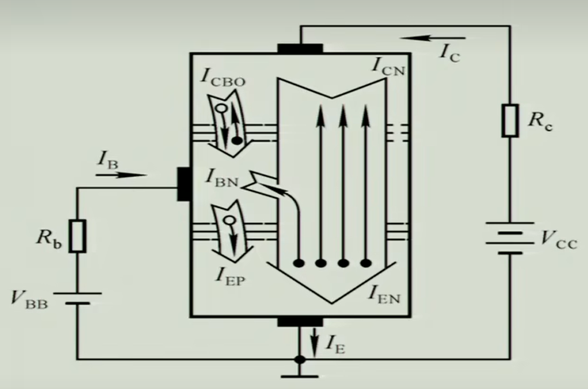
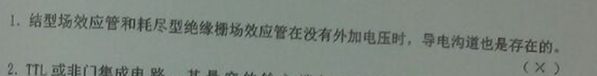

# 模电总结

> 基于《模拟电子技术基础（第五版）》（高等教育出版社）
>
> 往年试题
>
> ==涉及内容仅第一章==
>
> 如果发现有错误欢迎提issue
>
> 相关pdf文件在github仓库相同文件夹下

 [toc]  

## 目录(梳理整体轮廓)

- 半导体基础知识
  - 本征半导体
  - 杂志半导体
  - PN结
- 半导体二极管
  - 半导体二极管的几种常见的结构
  - 二极管的伏安特性
  - 二极管的主要参数
  - 二极管的等效电路
  - 稳压二极管
  - 其他类型的二极管
- 晶体三极管
  - 晶体管的结构及类型
  - 晶体管的电流放大作用
  - 晶体管的共射特征曲线
  - 晶体管的主要参数
  - 温度对晶体管特征及参数的影响
  - 光电三极管
- 场效应管
  - 结型场效应管
  - 绝缘栅型场效应管
  - 场效应管的主要参数
  - 场效应管和晶体管的比较

## 小结(过一遍基础知识点)

> ==二极管、晶体管、场效应管的工作原理，特征曲线，主要参数==
>
> ==了解管子内部结构及载流子的运动应**以理解外部特征为主**==

### 杂质半导体和PN结

1. 在本征半导体掺入五价元素（如磷）就形成N型半导体，掺入三价元素（如硼）就形成了P型半导体，控制掺入杂质的多少就可有效的实现导电性能的可控性。(常用半导体材料是硅)
2. 半导体中有两种载流子：自由电子和空穴。
3. 载流子有两种有序的运动：因浓度差而产生的运动称为扩散运动，因电位差而形成的运动称为漂移运动。
4. 在同一个硅片（或者锗片）上制作两种杂质半导体，在它们的交界面就形成了PN结。
5. 正确理解PN结的单项导电性、反向击穿特性、温度特性和电容效应（将有利于了解半导体二极管、集体管和场效应管等电子器件的特征和参数）
   1. PN结的单项导电性
   2. PN结的反向击穿特性
   3. PN结的温度特性
   4. PN结的电容效应

### 半导体二极管

1. 将一个PN结封装并引出电极后就构成了二极管
2. 二极管加正向电压时，产生扩散电流，电流和电压成指数关系；加反向电压时，产生漂移电流，其数值很小；**体现单向导电性**
3. $I_F$  $I_R$  $U_R$ $f_M$  是二极管的主要参数
   - $I_F$
   - $I_R$ 
   - $U_R$ 
   - $f_M$ 
4. 特殊二极管也具有单项导电性
5. 利用PN结**反向击穿的特性**可制成稳压二极管，利用发光材料可以制成发光二极管，利用PN结的光敏性可制成广电二极管

### 晶体管

1. 当发射结正向偏置且集电结反向偏置时，晶体管具有电流放大作用

2. 发射区多子的扩散运动形成 $I_E$ ,基区非平衡少子与多子的复合运动形成基极电流 $I_B$ ,集电结少子的漂移运动形成 $I_C$ 

3. $i_B$ 对 $i_C$ 具有控制作用，$i_C = βi_C$ ,可将 $i_C$ 看成受电流 $i_B$ 控制的电流源

4. 晶体管的输入特征和输出特征表明各级之间电流与电压的关系，$β、α、I_{CBO}(I_{CEO})、I_{CM}、U_{(BR)CEO}、P_{CM} 和 f_T$ 是它的主要参数

5. 晶体管有截至、放大、饱和三个工作区域，学习时应特别注意管子工作在不同工作区的外部条件

6. 特殊三极管与晶体管一样，也能够实现 **输入信号对$ i_C$ 的控制** 

7. 晶体管工作状态的判断

   

   

### 场效应管

1.  场效应管分为结型和绝缘栅型两种类型，每种类型又分为N沟道和P沟道两种，同一沟道的MOS管又分为增强型和耗尽型 
1.  场效应管工作在恒流区时，利用栅 - 源之间外加电压所产生的电场来改变导电沟道的宽窄，从而控制多子漂移运动所产生的漏极电流$i_D$ 。
1.  此时，可将$i_D$ 看成电压$u_{GS}$ 控制的电源流，转移特征曲线描述了这种控制关系。 输出特征曲线描述了 $u_{GS}、u_{DS}与i_D$ 三者之间的关系。
1.  $g_m、U_{GS(th)}、或 U_{GS(off)}、I_{DSS}、I_{DM}、U_{(BR)DS}、P_{DM}$ 和 极间电容是它的主要参数。
1.  **与晶体管相类似，场效应管有夹断区，恒流区和可变电阻三个工作区域。** 
1.  因**VMOS** 管较好地解决了散热问题，故可制成大功率管。

### 总体特性

1. 半导体材料的光敏性和热敏性具有两面性，一方面它使普通半导体器件的温度稳定性变差；另一方面又可以利用它来制成特殊半导体器件，如光敏器件和热敏器件。

2. 尽管各种半导体器件的工作原理不尽相同，但在外特性上却有不少相同之处。

   > 例如：
   >
   > - 晶体管的输入特性与二极管的输入伏安特性相似
   > - 二极管的反向特性（特别是光电二极管在第三象限的反向特性）与晶体管的输出特性相似
   > - 而场效应管与晶体管的输出特性也相似	

   

## 学习要求

### 熟悉/能解释

PN结的两侧分别是P型半导体和N型半导体，P型半导体的多子是空穴，N型半导体的多子是自由电子。在交界面，因为两种载流子的**浓度差**，导致，N端的自由电子流向P端，并与P端的空穴进行**复合**，这个运动过程称为**扩散**。经过扩散，导致N端整体呈正电性，P端呈负电性，因为两端的电势差，自然内部存在从N-->(指向)P的电场，也就是内建电场。

1. 自由电子和空穴

   > **自由电子** 是指没有组成共价键的电子，能够导电的电子
   >
   > **空穴** 是指，本征半导体，经过本征激发，原本组成共价键的电子逃逸，留下的位置（因为电子带负电，所有空穴显正电）
   >
   > ==P型半导体内部的多子是空穴；N型半导体内部的多子是自由电子==

2. 扩散与漂移

   > 在PN结处：
   >
   > ​	由浓度引起的载流子的定向移动称为 **扩散**
   >
   > ​	因为内建电场引起的载流子的定向移动称为 **漂移**

3. 复合

   > 电子和空穴再次结合

4. 空间电荷区

   > PN结又叫空间电荷区

5. PN结

   > P型半导体和N型半导体的交界面会又特殊的性质，称为PN结
   >
   > PN结又称为
   >
   > 1. 空间电荷区
   > 2. 耗尽层
   >
   > 采用不同的掺杂工艺，通过扩散作用，将P型半导体与N型半导体制作在同一块半导体（通常是硅或锗）基片上，在它们的交界面就形成空间电荷区称为**PN结**

6. 耗尽层

   > **指PN结中在漂移运动和扩散作用的双重影响下载流子数量非常少的一个高电阻区域**

7. 导电沟道

   > 在场效应管中，在栅极(g)的控制下，源极(s) 和漏极(d) 之间会形成导电沟道
   >
   > 导电沟道的主要作用就是使源极和漏极之间可以导电

   

8. 二极管的单项导电性

   > 只有在外部施加的电压是从P-->(指向)N ，PN结才能导通，外部表现为单项导电性。
   >
   > 只有外部电压大于开启电压才能表现为正向导电性（本质是施加的外部电压要大于内建电场）
   >
   > 而施加反向电压时相当于增加了势垒

   

9. 稳压管的稳压作用

   > 利用二极管的反向击穿特性（可以通过控制掺杂浓度控制稳压的范围）
   >
   > 齐纳击穿：适用于高掺杂浓度，稳压范围（一般小于6V），温度上升时，击穿电压下降（量子力学，隧穿）**齐纳击穿具有负的温度系数**
   >
   > 雪崩击穿：适用于低掺杂浓度，稳压范围 （一般大于6V）雪崩击穿电压随温度升高而升高
   >
   > > 原理：
   > >
   > > 通过观察二极管的伏安特征曲线，我们发现，在反向击穿电压$U_Z$ 附近，一点点
   > >
   > > 电压的变化 ，就能引起较大的电流的变化，根据这个特性，我们做出了稳压二极管。
   > >
   > > ---
   > >
   > > 
   > >
   > > 使用了二极管的电路中一般都存在一个限流电阻，我们假设稳压二极管正常工作，
   > >
   > > 稳压二极管的意思时，$R_L$ 在一定范围变化时，加在其身上的电压不变（或者变化
   > >
   > > 可以忽略不计），可以知道稳压二极管 $D_Z$ 和$R_L$ 两端的电压相同，假设 $R_L ↓$ 
   > >
   > > 则加在 $R_L$ 两端的电压应该升高，同时加在$D_Z$ 两端的电压上升，会引起通过 $D_Z$ 
   > >
   > > 的电流 $I_{DZ}↑↑$ ，同时，通过限流电阻 R 的电流 $I_R↑↑$ ，分摊在限流电阻 R 两端的
   > >
   > > 电压提高，最终导致，$R_L$ 两端的电压几乎不变
   > >
   > > 
   > >
   > > 

10. 晶体管的放大作用及三个工作区域

    > 晶体管（三极管）的两种用途:
    >
    > 1. 放大作用（放大信号）
    > 2. 开关作用
    >
    > 放大作用原理：放大系数 $β ≈ \frac{I_C}{I_B}$ 输入的电信号通过影响 $I_B$ 的大小进而影响 $I_C$ 的输出，放大区
    >
    > 开关作用：饱和区和截至区
    >
    > 晶体管的基区非常薄，并且掺杂浓度低

    

    

      

    

11. 场效应管的放大作用及三个工作区域

    区分晶体管和场效应管的工作原理：

    晶体管是通过控制 $I_B$ 的电流进而控制 $I_C$ 实现开关和放大作用

    场效应管（N沟道绝缘栅型场效应管）是通过控制$U_{GS}$ 的电压来控制导电沟道，最终实现开关作用和放大作用

    > 放大作用
    >
    > 三个工作区域

    

### 掌握

1. 二极管的工作原理、外特征和主要参数
   1. 工作原理
   
      > 当产生正向电压偏置时，外界电场与自建电场的互相抑消作用使载流子的扩散电流增加引起了正向电流（也就是导电的原因）。 
      >
      > 当产生反向电压偏置时，外界电场与自建电场进一步加强，形成在一定反向电压范围中与反向偏置电压值无关的反向饱和电流I0（这也就是不导电的原因）
   
   2. 外特征
   
      > 单向导电特性
   
   3. 主要参数
   
      > $I_F$  $I_R$  $U_R$ $f_M$  是二极管的主要参数
      >
      > - $I_F$：正向电流，额定功率下，允许通过二极管的电流值
      > - $I_R$ ：反向电流，在规定反向电压条件下，流过二极管的反向电流值
      > - $U_R$ ：最高反向电压，通常UR为击穿电压U(BR)的一半
      > - $f_M$ ：最高工作频率
   
2. 稳压管的工作原理、外特征和主要参数
   1. 工作原理
   
      > **稳压管**反向电压在一定范围内变化时，反向电流很小，当反向电压增高到击穿电压时，反向电流突然猛增，**稳压管**从而反向击穿，此后，电流虽然在很大范围内变化，但**稳压管**两端的电压的变化却相当小，利于这一特性，**稳压管**就在电路到起到**稳压**的作用了
   
   2. 外特征
   
      > 使元器件两端的电压保持不变
   
   3. 主要参数
   
      > $U_Z$：稳定电压
      >
      > $I_Z$ ：一定额定电流
      >
      > $R_Z$：动态电阻
   
   
   
3. 晶体管的工作原理、外特征和主要参数
   1. 工作原理
   
      > 在没有外加电压时，发射结N区的电子（这一区域的多数载流子）浓度大于P区的电子浓度，部分电子将扩散到P区。 同理，P区的部分空穴也将扩散到N区。 这样，发射结上将形成一个空间电荷区（也成为耗尽层），产生一个内在的电场，其方向由N区指向P区，这个电场将阻碍上述扩散过程的进一步发生，从而达成动态平衡。
      >
      > ---
      >
      > NPN型双极性晶体管可以视为共用[阳极](https://www.wikiwand.com/zh-hans/阳极)的两个二极管接合在一起。在双极性晶体管的正常工作状态下，**发射结**（基极与发射极之间的PN结）处于正向[偏置](https://www.wikiwand.com/zh-hans/偏置)状态，而**集电结**（基极与集电极之间的PN结）则处于反向偏置状态。在没有外加电压时，发射结N区的电子（该区域的[多数载流子](https://www.wikiwand.com/zh-hans/多数载流子)）浓度大于P区的电子浓度，部分电子将扩散到P区。同理，P区的部分空穴也将扩散到N区。这样，发射结上将形成一个空间电荷区（也称为[耗尽层](https://www.wikiwand.com/zh-hans/耗尽层)），产生一个内在的[电场](https://www.wikiwand.com/zh-hans/电场)，其方向由N区指向P区，这个电场将阻碍上述扩散过程的进一步发生，从而达成动态平衡。这时，如果把一个正向电压施加在发射结上，上述载流子扩散运动和耗尽层中内在电场之间的动态平衡将被打破，这样会使热激发电子注入基极区域。在NPN型晶体管里，基区为P型掺杂，这里空穴为多数掺杂物质，而电子则为[少数载流子](https://www.wikiwand.com/zh-hans/少数载流子)。[[来源请求\]](https://www.wikiwand.com/zh-hans/Wikipedia:列明来源)
      >
      > 从发射极被注入到基极区域的电子，一方面与这里的多数载流子空穴发生[复合](https://www.wikiwand.com/zh-hans/复合)，另一方面，由于基极区域掺杂程度低、物理尺寸薄，并且集电结处于反向偏置状态，大部分电子将通过漂移运动抵达集电极区域，形成集电极电流。为了尽量缓解电子在到达集电结之前发生的复合，晶体管的基极区域的厚度必须远小于电子的扩散长度（diffusion length，参见[菲克定律](https://www.wikiwand.com/zh-hans/菲克定律)），使得载流子扩散所需的时间短于半导体少数载流子的寿命。在现代的双极性晶体管中，基极区域厚度的典型值为十分之几微米。需要注意的是，集电极、发射极虽然都是N型掺杂，但是二者掺杂程度、物理属性并不相同，因此必须将双极性晶体管与两个相反方向二极管串联在一起的形式区分开来。
   
   2. 外特征
   
      > 开关作用
      >
      > 放大作用
   
   3. 主要参数
   
      > $U_{CES}$ ： 三极管集电极与发射极之间的饱和电压（临界饱和状态时，$U_{CES} = U_{BE}$）
      >
      > $U_{CE}$ ：称为压降，电流流过负载以后相对于同一参考点的电势（电位）变化。
      >
      > 
   
4. 场效应管的工作原理、外特征和主要参数
   1. 工作原理
   
      > 场效应管的工作原理其实很简单，就是用两个状态表示二进制的“0”和“1”。
      >
      > 　　源极和漏极之间是沟道(Channel)，当没有对栅极(G)施加电压的时候，沟道中不会聚集有效的电荷，源极(S)和漏极(S)之间不会有有效电流产生，场效应管处于关闭状态。可以把这种关闭的状态解释为“0”。
      >
      > 　　当对栅极(G)施加电压的时候，沟道中会聚集有效的电荷，形成一条从源极(S)到漏极(D)导通的通道，场效应管处于开启状态，如图3所示，可以把这种状态解释为“1”。这样二进制的两个状态就由场效应管的开启和关闭状态表示出来了。
      >
      > 
   
   2. 外特征
   
      > 开关作用
      >
      > 放大作用
   
   3. 主要参数
   
      > 
      >
      > 
      >
      > 
      >
      > 
   
   **晶体管**有三**个极**；双**极**性**晶体管的三个极**，分别由N型跟P型组成发射**极**（Emitter）、基**极**(Base) 和集电极（Collector）；场效应**晶体管的三个极**，分别是源**极**（Source）、栅**极**（Gate）和漏**极**（Drain）

## 习题

### 一、 

   #### 解析：

   1. √
   2. × 半导体呈电中性
   3. √ 动态平衡
   4. × 放大状态时发射结正偏，集电结反偏，发射极促进多子运动，集电极促进的是少子的运动，集电极的这些少子来自**发射极的多子**，所以浓度远远大于集电极本身的多子，所以叫非平衡少子，由于集电结反偏，促进这些非平衡少子运动，产生了集电极的主要电流。
   5. √
   6. × 没加外部电压时就已经是导通的了

### 二、 

   #### 解析：

   1. 变窄      PN结外加正向电压，此时外电场将多数载流子推向空间电荷区，**使其变窄**，削弱了内电场，破坏了原来的平衡，使扩散运动加剧，漂移运动减弱，由于电源的作用。扩散运动将源源不断地进行，从而形成正向电流，PN结导通。
   2. C
   3. C
   4. B
   5. AC

### 三、 

   #### 解析：

   1. 二极管已经导通，理想化等效模型 U = 2V-0.7V = 1.3V

   2. 理想二极管，反向截至，U = 0

   3. -1.3V

      

   4. 不导通，U = 2V

   5. 1.3V

      

   6. 二极管反向，不导通 U = -2V

### 四、 

#### 解析：

1. 6V
2. 5V （稳压二极管没有工作，但是反向截至）

### 五、

#### 解析：

1. 
2. 

### 六、

#### 解析：

### 七、历年题

1. 

   要求集电极电压高于基极，并且，基极电压高于发射极

2. 

   ==不理解==

3. 

   饱和时，发射极和集电极电流都流向基极

1. 

   

2. 

3. 

4. 

5. 

   

6. 

7. 

8. 

   

9. 

10. 