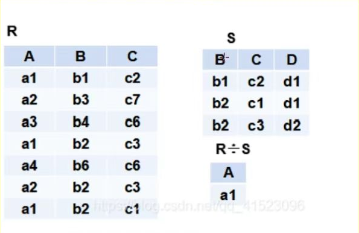
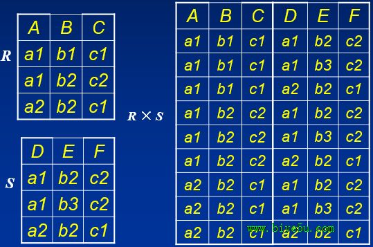

# 数据库笔记

## 第一章 绪论

### 1.数据库的四个基本概念

1. 数据：描述事物的符号记录
2. 数据库：数据库具有 **永久存储、有组织、可共享** 三个特点
3. 数据库管理系统： 是位于用户和操作系统之间的一层数据管理软件，和操作系统一样是计算机基础软件
4. 数据库系统：由数据库、数据库管理系统、应用程序、数据库管理员组成的系统

### 2.数据库的发展阶段

1. 人工管理阶段
2. 文件系统阶段
3. 数据库管理系统 （**共享性**）

### 3. 数据模型

1. 两类数据模型： 概念模型 + 逻辑模型和物理模型

2. 概念模型：也称为信息模型，它是按用户观点来对数据和信息建模，主要用于对数据库设计

   - 实体： 客观存在并可相互区别的事物

   - 属性：实体所具有的某一特性

   - 码：唯一标识实体的属性

   - 实体型： 实体名和属性的集合

   - 实体集：实体型的集合

     > 概念模型的一种表示方法——E-R 图

3. 逻辑模型：它是按照计算机系统的观点对数据建模，主要用于数据库管理系统的实现
   - 层次模型
   - 网状模型
   - 关系模型
     - 关系：一个关系通常说的是一张表
     - 元组：表中的一行
     - 属性：表中的一列
     - 码：也称码键，表中的某个属性组
     - 域：是一组具有相同数据类型的值的集合
     - 分量：元组中的一个属性
4. 物理模型：是数据最底层的抽象，它描述数据在系统内部的表示方法和存储方法，或在磁盘上的存储方式，是面向计算机系统的
5. 联系：
   1. 实体之间的联系，通常指不同实体集之间的联系。（实体之间的联系有一对一，一对多，多对多等多种联系）
   2. 实体内部的联系通常指实体各属性之间的联系

### 4. E-R 图

> 在线画图 www.draw.io

1. 实体 	长方体
2. 属性    椭圆形（主键加下划线）
3. 关系    菱形

### 5.数据库系统的结构

1. 模式是数据库中全体数据的逻辑结构和特征的描述，它仅仅涉及型的描述，不涉及具体的值，其一个具体的值称为模式的一个实例

   > 模式是相对稳定的，实例是相对变动的

2. 三级模式结构：==外模式+模式+内模式==  （★★★）

   - 外模式
     - 局部逻辑结构
   - 模式（概念模式）
     - 全局逻辑结构
   - 内模式：存储模式，一个数据库只有一个内模式，它是数据物理结构和存储方式的描述，是数据在数据库内部的组织方式

3. 二级映像

   1. 外模式/模式
   2. 模式/内模式

### 6. 数据库系统的组成

1. 硬件平台及数据库
2. 软件
3. 人员


---


## 第二章 关系数据库

### 1. 关系模式

**R(U, D, DOM, F)**

- R：关系名
- U：所有属性名
- DOM：属性和域之间的映射
- F：属性间的依赖关系

### 2. 关系的操作

> CRUD (增删查改)

查询的操作：选择，投影，连接，除法，并，差，交，笛卡尔积

### 3. 关系语言的分类

1. ==关系代数语言== （★）
   1. 是一种抽象的查询语言，通过对关系的运算来表达查询
   2. 三大要素
      - 运算关系
      - 运算符
      - 运算结果
2. ~~关系演算语言~~
3. SQL语言

### 4. 关系语言

1. 并运算

2. 交运算

3. 差

4. 除

   > 保留除数中满足被除数属性对应值（全部）并且将被除数对应属性列去掉的关系

   

5. 笛卡尔积

   >  笛卡尔积的操作

   

6. 连接

   1. **自然连接**
      - 把共同属性进行等值连接（把所有字段名都放在一起）
      - 先把两个表里面属性的列出来（并集-交集）
      - 然后把交集属性值相同的元组进行拼接
      - 交集属性值不同的部分抛弃（悬浮元组）
   2. 外连接
      - 把悬浮元组也保留在关系中，没有的属性写null
   3. 左外连接
      - 只保留左边关系中的悬浮元组
   4. 右外连接
      - 只保留右边关系中的悬浮元组

7. 选择

### 5.关系的完整性

1. 实体完整性

   > 主码唯一且非空

2. 参照完整性

   > 外码要么为空，要么对应另一个表的主码

3. 用户定义完整性

   > 你自己写的要完整，比如学号多少，姓名，班级

   

---


## 第三章

### 1. sql 的基本概念

1. sql语言：结构化查询语言（最重要的是查询）

2. DDL(数据定义语言)

   主要用来定义逻辑结构，包括定义基表，视图和索引，删除表，定义表，修改表

3. DQL(数据查询语言)

   对数据库中的数据对象进行查询

4. DML(数据操纵语言)

   用于改变数据库中的数据，包括插入，删除，修改

5. DCL(数据控制语言)

   对表和视图授权，完整性规则的描述，以及事务的开启和结束

### 2.sql 语言的特点

1. 高度非过程化（只需要说明做什么，而不用指明怎么做）
2. sql 是自含式语言，又是嵌入式语言（可以嵌入高级语言程序中）

### 3.sql 的基本语法

1. sql 的数据类型

   1. char(n) 定长的字符串
   2. varchar(n) 变长字符串（n 最大长度）
   3. int， smallint，bigint
   4. Decimal(p,d)     p 表示一共有几位数字  d 表示小数点后几位
   5. float(n)   精度至少为n位数字
   6. data    日期   YYYY-MM-DD
   7. time    时间   HH:MM:SS
   8. timestamp     时间戳

2. 模式的定义和删除

   为用户 wang 定义一个学生-课程模式 S-T

   ```sql
   create schema "S-T" authorization wang create table user(id int primary key, age int, name varchar(255))
   -- 模式定义后面 加表的定义子句，视图定义子句，授权定义子句 三选一
   ```

   ```sql
   drop schema "S-T" cascade
   -- cascade 级联模式
   -- restrict 限制模式
   ```

   

3. 表的定义，修改和删除

   ```sql
   create table user(
   age int,
   sex char(1)
   )
   ```

   删除

   ```sql
   drop table user cascade
   ```

   修改

   ```sql
   alter table user add pwd varchar(255)
   ```

   

4. 索引的建立，修改和删除

   > 可以为一列增加索引，也可以为多列增加索引

   ```sql
   create unique index Stusno on Student(Sno)
   -- unique 唯一索引
   -- cluster 聚簇索引
   ```

   ```sql
   alter index Stusno rename to Student_id_Sno
   ```

   ```sql
   drop index Student_id_Sno
   ```


### 4. 查询语句

1. 查询所有

   ```sql
   select * from table_name;
   ```

   

2. 查询某一列

   ```sql
   select col_name from table_name;
   ```

   

3. 结果去重

   ```sql
   select distinct col_name from table_name;
   ```

   

4. 条件查询

   ```sql
   select col_name from table_name where 条件;
   ```

   

5. 模糊查询

   %代表有无数个字符

   _代表有一个字符

   ```sql
   select col_name from table_name where clo_name like '% char _';
   ```

   

6. 聚合函数

   ```sql
   sum	求和
   avg 求平均
   count 统计个数
   max
   min
   ```

   

7. 分组查询

   ```sql
   select col_name from table_name group by col_name;
   select col_name from table_name group by col_name having 条件; 
   ```

   

8. 连接

   ```sql
   select * from table_name1, table_name2 where table_name1.id = table_name2.id;
   ```

   

9. 自身连接

   ```sql
   select * from table_name, table_name where table_name.id = table_name.id;
   ```

   > 自身连接有什么意义

10. 外连接

    1. 左外连接

       ```sql
       select * from table_name1 left outer join table_name2 on table_name1.id = table_name2.id;
       ```

       

    2. 右外连接

       ```sql
       select * from table_name1 right outer join table_name2 on table_name1.id = table_name2.id;
       ```

       

11. 多表查询

    1. 多表联查

       ```sql
       select * from table_name1,table_name2;
       -- 不加条件默认两个表做笛卡尔积 
       select * from table_name2,table_name2 where table_name1.id = table_name2.id;	
       ```

       

    2. 子查询（可以优化效率）

       1. `select`的子查询

          ```sql
          -- 原查询
          select company.company_name from company, person where company.id = person.company_id and person.name =  'test';
          -- 子查询
          select (select name from company where id = company_id) from person where name='test';
          ```

          

       2. `where`子查询

          ```sql
          -- 原查询
          select company.company_name from company, person where company.id = person.company_id and person.name =  'test';
          -- 子查询
          select name from company where id = (select company_id from person where name='test');
          ```

          

       3. `from`子查询

          > select子查询和where子查询是把查询结果当成数据
          >
          > from子查询是把查询结果当成表

12. 数据插入、修改、删除

    插入

    ```sql
    insert into table_name(字段名) values(数据)
    -- 注意在工程实践中一般字段名不能省略
    ```

    修改

    ```sql
    update table_name set 字段名 = 数值 where 条件
    ```

    删除

    ```sql
    delete from table_name where 条件
    ```

    

13. 
