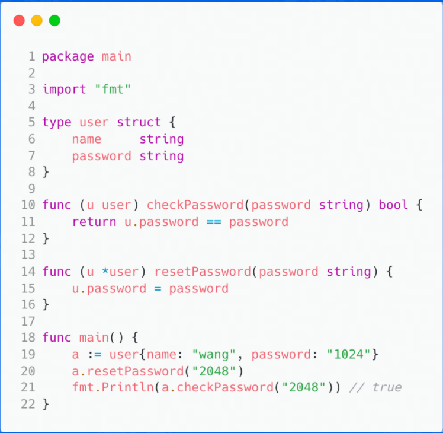
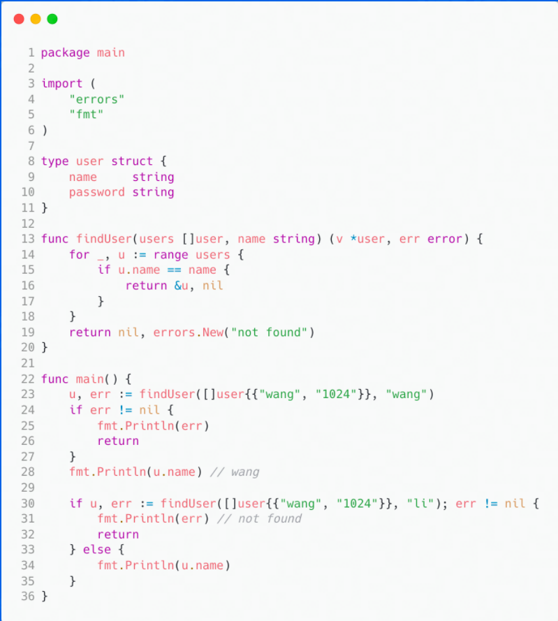
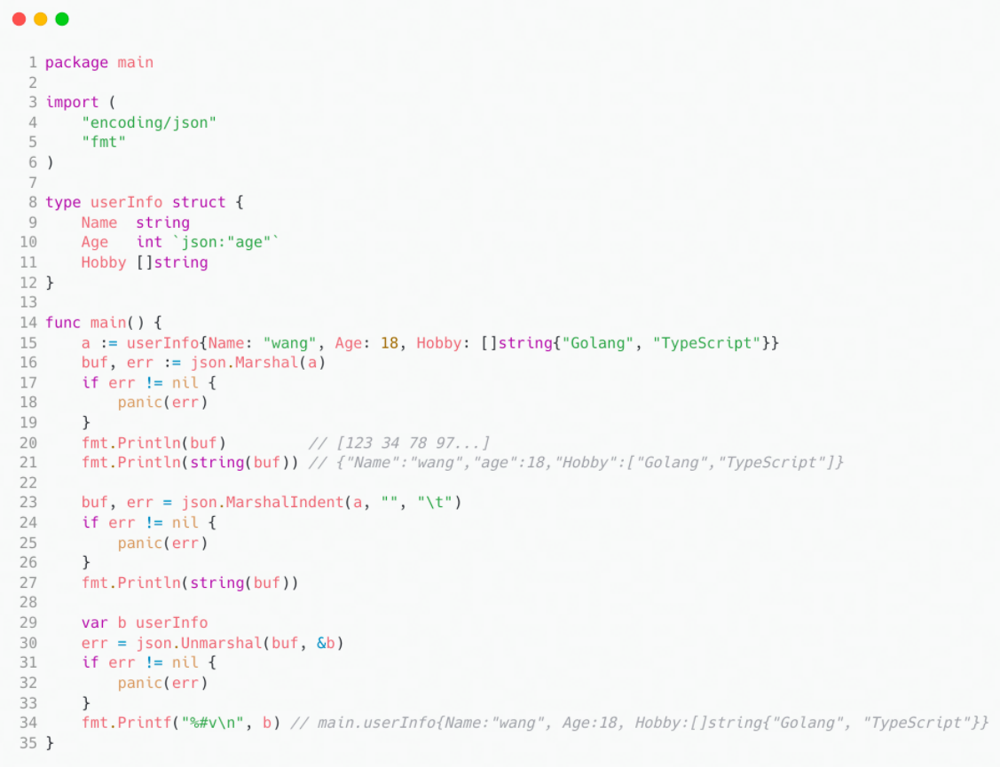
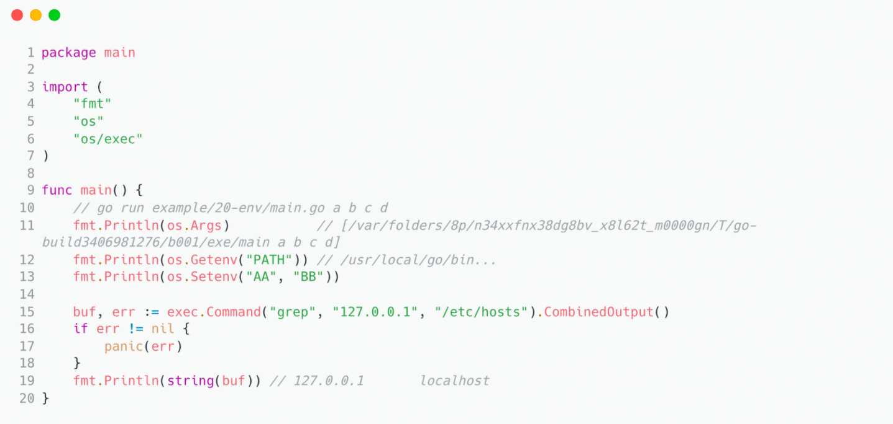

#  Go 语言上手 - 基础语言 | 青训营笔记

> 这是我参与「第三届青训营 -后端场」笔记创作活动的的第1篇笔记	

[TOC]

### go 语言的特点

1. 高性能、高并发 
   1. go的性能堪比C++
   2. go原生支持高并发，不依赖第三方库
2. 语法简单
   1. 本来以为 C 已经够简单了（基础语法），没想到 go 在 C 的基础上还能做优化
   2. 举例：循环只有 for 一个
   3. 但是去掉不必要的括号emmm，可能是区别于其他语言吧，一开始还是很不好上手的
3. 丰富标准库
4. 完善工具链
   1. 编译
   2. 代码格式化（★大家都一样）
   3. 错误检查
   4. 帮助文档
   5. 包管理
   6. 代码提示
   7. 完整的单元测试框架内（★强）
5. 静态编译
   1. 只需要拷贝编译后的唯一可执行文件就可以运行
   2. （怎么感觉越来越像 dev 了，代码格式化和编译生成的可执行文件方面）
6. 快速编译（这个也是强的★）
7. 跨平台
8. 垃圾回收

总结一下：go是真的很强，**python的代码量，c的执行速度** 不是吹的

### go的基础语法

1. 变量

   1. 变量类型

      1. 字符串（内置类型）
      2. 整数
      3. 浮点数
      4. bool型

   2. 变量的声明

      1. 自动推导变量类型

         ```go
         var a = "init"
         ```

         

      2. 显示定义

         ```go
         var a, b int 1, 2
         ```

         

      3. 变量名  := 值

         ```go
         f := float32(3.14)
         //注意
         float //是错误写发
         float32	//正确写法
         float64 //正确写法
         ```

         

2. 判断语句

   不带 **()**

   ```go
   if 2>1{
       fmt.Println("true")
   }else{
       fmt.Println("false")
   }
   ```

   **在golang里面试了一下，if 后面加括号了，编译的时候，编辑器自动去掉了**

   *这也就说明，在 go 里面不支持 if 判断里面有多个语句*

3. 循环语句

   1. for 后面啥都不写  **死循环**

      ```go
      for {
      		fmt.Println("Hello World")
      }
      ```

      

   2. 三语句经典for循环，去掉 *多余的括号* 

      ```go
      for i := 0; i < 10; i++ {
      		fmt.Println("Hello World")
      }
      ```

      >  i++ 和 i-- 在 **Go 语言**中是*语句*，不是*表达式*，因此不能赋值给另外的变量。 此外 **没有** ++i 和 --i 。
      >
      > **表达式是可以被求值的代码，而语句是一段可执行代码。** 

      我只能表示，学到了！

   3. 只写判断语句（这个在C里面好像要写两个空语句，我以为在go里面需要占位呢）

      ```go
      //第一个
      i := 0
      for i<3{
          i++;
          fmt.Println(i)
      }
      //第二个
      for i:=0; i<3;{
          i++;
          fmt.Println(i)
      }
      //比较一下，发现，go也需要占位
      ```

      

4. 选择语句

   1. 不需要 **break** 

      ```go
      i := 2
      switch i {
          case 1:
          fmt.Println("one")
          case 2:
          fmt.Println("two")
          case 3:
          fmt.Println("three")
          case 4, 5: //还能这样？反正C不支持
          fmt.Println("four or five")
          default:
          fmt.Println("other")
      }
      ```

      是不是可以这样理解，你按照C的严谨来写，肯定对。

      有一说一，有点JavaScript和Java之间的感觉了

   2. 支持任意类型的变量类型

      ```go
      t := time.Now()
      switch {
          case t.Hour() < 12:
          fmt.Println("yes")
      }
      ```

      

5. 数组

   定义的格式：var 数组名 []变量类型

   ```go
   var arr [5]int
   arr[0] = 0 
   fmt.Println(arr[0])
   
   //竟然可以这样输出
   var arr [5]int
   arr[0] = 1
   fmt.Println(arr)
   //输出结果
   [1 0 0 0 0]
   ```

   

6. 切片

   定义格式：变量名 := make([]变量类型，长度)

   ```go
   s := make([]string, 3)
   ```

   扩容

   ```go
   s = append(s,"d")
   s = append(s,"e","f")
   ```

   

7. map(又名hash，字典) ==> 一种数据结构

   定义格式：hash := make(map[string]int)

   键值对

   通过 **delete** 删除键值对 

8. range 快速遍历

   1. 对于数组返回 index 和 元素

   2. 对于map返回 key 和value

      ```go
      index, num := range nums
      ```

      

9. 函数

   1. 定义格式：func 函数名（参数1，参数2……）返回值类型（写起来确实有点难受）
   2. 支持返回多个值（头大，好奇，反正C不支持，其实可以思考一下，一个函数到底该不该支持返回多个值呢？这估计是个哲学问题）

10. 指针（弱化了的，也可能是C的指针太强了，毕竟指针是C的灵魂）

    引入指针是为了方便对传参进行修改，这点让我想起了学C指针的第一个程序

    ```c
    void function(int a){
        a = a+1;
        printf("%d",a);//a1
    }
    	printf("%d",a);//a2
    //问a1 和 a2的值相同吗？
    //至于为什么无法修改，涉及到传参机制和函数运行压栈的问题
    //结论是我们要学指针
    ```

    

11. 结构体

    定义结构：type 结构体类型名 struct

    ```go
    type user struct{
        name string
        pwd string
    }
    ```

    对比看一下C代码实现上述情况

    ```c
    typedef struct USER{
    	//内部就不写了，C没有string类型
    }user;
    ```

12. 结构体函数

    1. 类似于类成员函数

       不得不说，go是真的很强

       

13. 错误处理

    利用函数可返回多个值

    目标值，错误信息

    

14. 格式化输出

    1. 可以用 %v 来代替指定变量类型，这样就会自动识别输出的类型
    2. 也可以用 %#v 进行控制输出，这样就会输出相信的信息
    2. 其余的和C的printf 没有相似

15. JSON处理

    1. 可以之间对返回的JSON串进行读取，并拿到信息，但是不推荐

    2. 一般先定义一个和JSON值相对应的结构体，注意 **结构体成员变量名的第一个字母应该大写** 

       > 发现一件事情，go 里面提供的方法（特别是流的转换方法）都习惯返回两个值，第二个是报错信息

       

16. 时间处理

    提供了 time 时间包，最常用的还是 

    ```go
    t := time.Now()	//获取当前时间
    ```

    当然，go 也支持 指定对象时间 和 时间戳 操作

    1. 可以用 time.date 构造一个带时区的时间
    2. 可以用 .UNIX 获取时间戳

    当然，还有一个神奇的日期，这个是写死的。用这个来格式化时间

    ```go
    2006-01-02 15:04:05
    
    func main() {
        timeString := time.Now().Format("2006-01-02 15:04:05")
        fmt.Println(timeString)
    }
    ```

    

17. 数字解析

    1. 从流中读取字符串，并将字符串转数字
    2. 调用  strconv.ParseInt(字符串，进制，整型位数) 将返回一个整数 和 转换信息（是否转换成功）
    3. 调用  strconv.ParseFloat(字符串，浮点型位数) 将返回一个浮点数 和 转换信息（是否转换成功）
    4. 调用  strconv.Atoi(字符串) 

    ```go
    a, _ := strconv.Atoi("12.3")
    b, _ := strconv.Atoi("123")
    fmt.Println("a =", a, "b =", b)
    // 输出结果
    // a = 0 b = 123
    ```

    

18. 进程信息

    

     

    

    
