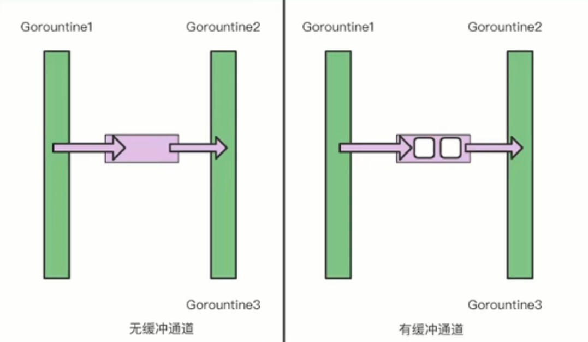

#  Go 语言上手-工程实践 | 青训营笔记

> 这是我参与「第三届青训营 -后端场」笔记创作活动的的第2篇笔记

## 语言进阶

[TOC]


### 背景

1. 并发VS并行

   并发：多线程程序在一个核的cpu上运行

   并行：多线程的程序在多个核的cpu上运行

   **一般说的并发是广义上的并发，并行可以算是实现并发的一种手段**

### Goroutine

1. 协程和线程

   协程：用户态，轻量级线程，栈MB级别

   线程：内核态，线程跑多个协程，栈KB级别（系统操作）

   Tips：go语言一次可以创建上万级别的协程

   > **线程和进程的区别**
   >
   > 线程是有共享内存的,进程没有共享内存

   

2. 在实际开发过程中如何去开启一个协程

   实例：快速打印

   ```go
   func printHello(i int) {
   	println("hello goroutine:", fmt.Sprint(i))
   
   }
   func main() {
   	for i := 0; i < 5; i++ {
   		go func(j int) {
   			printHello(j)
   		}(i)
   
   	}
       //做阻塞，避免主协程在子协程执行完之前退出
   	time.Sleep(time.Second)
   }
   ```

   输出结果

   ```go
   hello goroutine: 4
   hello goroutine: 3
   hello goroutine: 2
   hello goroutine: 0
   hello goroutine: 1
   ```

   修改一下

   ```go
   func printHello(i int) {
   	println("hello goroutine:", fmt.Sprint(i))
   
   }
   func main() {
   	for i := 0; i < 5; i++ {
   		go func() {
   			printHello(i)
   		}()
   	}
   	time.Sleep(time.Second)
   }
   ```

   输出结果

   ```go
   hello goroutine: 2
   hello goroutine: 5
   hello goroutine: 5
   hello goroutine: 5
   hello goroutine: 3
   ```

   

### CSP

> 协程通信
>
> go 提倡通过通信共享内存
>
> 通过内存共享通信必须要获取临界区的权限，并且需要通过互斥链进行加锁


### Channel（通道）

> channel 是一种引用类型
>
> 通过make关键字开启
>
> 语法
>
> ```go
> // make(chan 元素类型, [缓冲大小])
> //无缓冲通道
> make(chan int)
> //有缓冲通道
> make(chan int, 2)
> ```



```go
//以一个生产消费模型来
func main() {
	src := make(chan int)
	dest := make(chan int, 3)
	go func() {
		defer close(src)
		for i := 0; i < 10; i++ {
			src <- i
		}
	}()
	go func() {
		defer close(dest)
		for i := range src {
			dest <- i * i
		}
	}()
	for i := range dest {
		fmt.Println(i)
	}
}
```

```go
//输出结果
0
1
4
9
16
25
36
49
64
81
```


### 并发安全Lock

不加锁可能导致多个协程同时使用临界区的内存资源，这就是并发不安全的问题

### WaitGroup

协程可以暴力的使用sleep进行阻塞，但是这种方式并不优雅，原因在于，执行之前我们并不知道应该阻塞多长时间

如何优雅的阻塞协程？

我们可以使用 WaitGroup

WaitGroup暴露了三个方法

1. add      **计数器+1**
2. done    **计数器-1** 
3. wait     **阻塞直到计数器个数为0**

----

## 依赖管理

### 背景

1. 工程文件不可能基于标准库,从0到1进行搭建
2. 管理依赖库

### Go依赖管理演进

> 进行依赖管理的目的
>
> 1. 不同环境(项目),依赖的版本不同
> 2. 控制依赖库的版本不同

1. GoPATH

   go path 的目录树

   1. bin  项目编译产生的二进制文件
   2. pkg 项目编译产生的中间文件,加速编译
   3. src  项目源码

> - 项目代码直接依赖 src 下的代码
> - go get 下载最新版本的包到 src 目录下

​	go path 的弊端

​	**无法实现多版本的控制**

2. Go Vendor

> 为了解决go path 的弊端产生了go vendor

​	通过, **每个项目引入一份项目依赖的副本,解决了多个项目需要同一个package依赖的冲突问题**

3. Go Module

- 通过 go.mod 文件管理依赖包的版本
- 通过 go get/go mod 指令工具管理依赖包

> 目的: 定义版本规则和管理项目依赖关系

### 依赖管理三要素

1. 配置文件,描述依赖    go.mod
2. 中心仓库管理依赖库  Proxy
3. 本地工具                    go get/ go mod

### 依赖配置


**go mod** 通过控制go proxy 环境变量来控制go proxy的配置

go mod的三个工具

```bash
go mod init     #初始化,创建go.mod 文件
go mod download #下载模块到本地
go mod tidy     #增加需要的依赖,删除不需要的依赖
```


