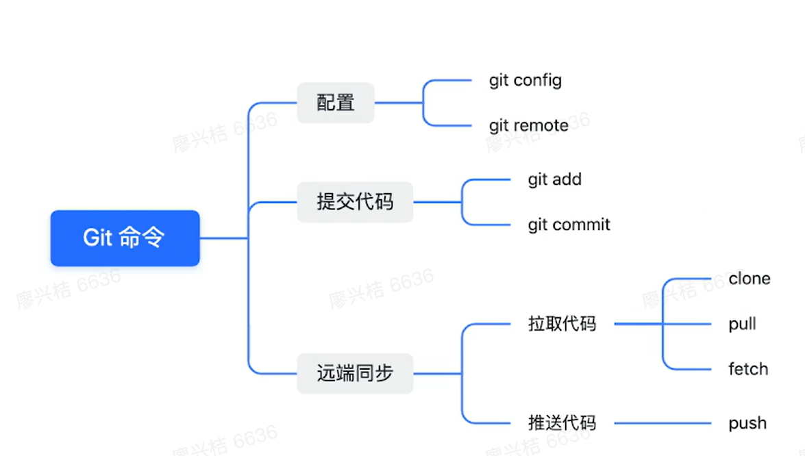
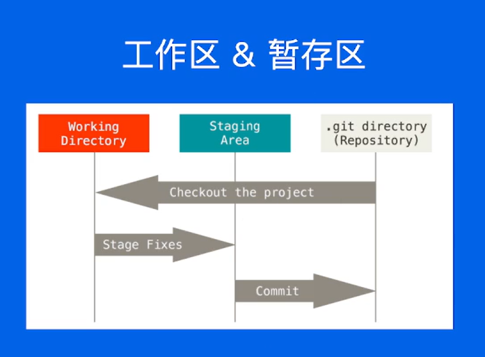

# Git 的正确使用姿势与最佳实践 | 青训营笔记

> 这是我参与「第三届青训营 -后端场」笔记创作活动的的第3篇笔记	

[TOC]


## 前言引入

### 为什么要学习Git

1. 在协同工作中要用到Git
2. 参与开源社区的贡献要用到Git（Git占大多数）

### 青训营为什么要设计Git这门课

#### 常见问题

1. 入职后只会按照文档去配置Git，然后在拉取代码的过程中出现问题，却不知道该如何去解决。缺少自己排查配置的能力
2. 不懂Git的使用规范，在团队合作中会各种各样的问题，会给代码后期维护带来各种问题

#### 课程目标

1. 学习Git的基本命令，了解基本原理，在以后遇到类似Git使用问题，能自行去排查
2. **了解研发流程中的基本概念和规范，学会 *正确* 使用Git**

---

## Git 是什么

### 为什么会出现Git

> Git是什么？
>
> **分布式** *版本控制* 系统
>
> 分布式：与中心化相对，分布式就是全世界都有备份，没有所谓的中心
>
> 版本控制：可以帮助记录我们每一次的版本变化

问什么需要版本控制？

1. 为了方便对代码进行检查
2. 预防事故发生，方便回滚到误删误改之前的代码状态

### Git的基本原理

1. 每一个库都有完整的提交历史，可以直接在本地进行代码提交
2. 每次提交都是完整的文件快照而不是记录增量（与SVN相比）
3. 通过Push等操作来完成和远端代码的同步

#### Git的优却点

优点：

1. 分布式开发，每个库都是完整的提交历史，支持本地提交，**强调个体**
2. 分支管理功能强大，方便团队合作，多人协同开发 
3. 校验和机制保证完整性，一般只添加数据，很少执行删除操作，不容易导致代码丢失

缺点：

1. 相对SVN更复杂，学习成本更高
2. 对大文件的支持不是很好（完整文件快照，而不是文件增量）（这个缺点可以通过 git-Ifs工具来解决）

## Git 命令的基本使用方式及原理

### Git的基本命令介绍



### 常见问题

1. 配置Git配置后，仍然没办法拉取代码
   1. 没有配置ssh密码
2. Fetch了远端分支，但是查看本地的分支历史还是没有变化
   1. 不会默认指向marge操作

### Git的目录介绍 / 如何使用这些命令 / 命令的原理

通过命令行去初始化一个代码仓库 

```bash
mkdir demo
cd demo
git init
```

git init 命令默认的分支是master主分支

可以带参数

```bash
git init --initial-branch  #用于指定初始化的分支 （本机电脑）
git init --bare            #创建一个裸仓库（纯Git目录，没有工作目录）（服务器）
git init --template        #通过模板来创建预先构建好的自定义git目录
```

初始化git仓库之后，执行 tree.git命令

会打印出git目录树（tree是打印指定文件夹（也可以是磁盘）的目录树）

!



### 常见的Git配置 

1. 用户名配置

2. instead of配置

   替换push的协议（http or ssh）

3. Git别名配置

   ```bash
   git config --global alias.cin "commit --amend --no-edit"
   ```

   

4. Git Remote

   ```bash
   #查看命令
   git remote -v
   #添加命令
   git remote add origin_ssh git@github.com:git/git.git
   git remote add origin_http https://github.com/git/git.git
   ```

   可以通过配置 remote 信息，将clone 和push设置成两个仓库(场景：从github的仓库clone了代码，然后想push到自己的代码仓库，并且不想设置成两个源)

   push 命令中的参数 origin 就代表源

   ### Git命令

   1. git add .

      git add 后会在object目录下添加一条数据(也就是Blob 用于存储文件的信息)

   2. git status

      查看文件的状态

   3. git commit 

      git commit 后会在object目录下添加两条数据

      一个是用来存储文件目录信息的（Tree）

      另一个是用来存储文件提交信息的（Commit）

      > 如何把这三个信息串联到一起
      >
      > 通过Commit寻找Tree信息，每个Commit 都会存储对应的 Tree ID
      >
      > 再通过Tree中存储的Blob ID信息 获取对应的内容

   4. git checkout -b test

      创建名称为 test 的分支

      Refs文件存储的内容是当前提交版本的 Commit ID

      因此可以把ref当成指针，指向对应的 Commit

      tag 文件内存储的是发行版本的 Commit ID 

      和 ref不同的是，tag标签存储的是固定版本的 Commit ID 而不是当前选中的

   5. 获取当前版本的代码

      通过ref指针指向 commit 可获取唯一的代码版本信息

   6. 获取历史版本的代码

   7. 修改历史版本

      1. 通过 git commit --amend

         修改后commit id 会改变

      2. 通过 rebase

         

      3. 通过filter --branch

         

   8. git fsck --lost-found

      查找本地是否有悬空的commit

   9. git gc

      git 的垃圾回收，可以删除一些不需要的object，以及会对 object 进行体积压缩

   10. 通过下面两个命令来实现GC的目的

       ```bash
       git reflog expire --expire=now --all
       git gc --prune=now
       ```

       在进行gc之前需要将日志过期时间改成现在，然后再gc

   11. git clone

       克隆远端完整的代码仓库

   12. git fetch

       将远端某些分支最新的代码拉取到本地，但不会默认指向merge操作，需要手动和本地仓库进行合并

   13. git pull

       通过 git pull --rebase

       拉取远端某些分支的最新的代码，并于本地代码进行合并

   14. git push


## Git 常用的研发流程，我们应该选择怎样的研发流程

### 常见问题

1. 在Gerrit 平台上使用Merge的方式去合入代码

   Gerrit使集中式工作流，应该是主干分支开发完后直接push

2. 不了解保护分支，Code Review，CI的概念，研发流程不规范

   1. 保护分支，防止用户直接向主干分支提交代码，必须通过PR的方式来合入（pull request）
   2. code review 是人工检查
   3. CI是通过一些定制化的脚本来检查

3. 代码历史混乱，代码合并方式不清晰

   不清楚fast-forward 和 thre-way merge

### 集中式工作流

> 只依托于master分支进行研发活动

工作方式：

1. 先获取远端master分支
2. 直接在master分支进行修改
3. 提交前，拉取最新的master分支与本地代码进行合并，如果有冲突需要本地解决
4. 提交本地代码到master分支

Gerrit

特点：提供了强制的代码评审机制，保证了代码质量

### 分支管理工作流

#### Git Flow

> 分支类型丰富，规范严格

包含五种类型的分支：

1. master：主干分支
2. develop：开发分支
3. feature：特性分支
4. release：发布分支
5. hotfix：热修复分支

#### Github Flow

> 只有主干分支和开发分支，规则简单

选择团队合作的方式

1. owner创建好仓库之后，其他用户通过Fork的方式来创建自己的仓库，并在fork的仓库上进行开发
2. owner创建仓库，统一给团队内的成员分配权限，直接在一个仓库内开发

```bash
#先克隆远端的代码
git clone github@github.com
#向远端推送readme文件
git add .
git commit -m"add readme"
git push origin master
#创建新分支,并自动切换到创建的分支
git checkout -b feature
#修改readme文件，并推送到远端
git add .
git commit -m"updat readme"
git push origin feature	
#创建一个Pull request
#确认无误，merge该分支
#切回主分支
git checkout main
```

在Setting中配置规则

1. 保护主分支，不允许直接向主分支进行push操作
2. 需要第三人来确认merge操作
3. ……

**代码合并方式**

1. Fast-Forward

```bash
#在新分支更新文件
git checkout -b test
#修改文件
#切回主分支
git checkout main
#快速合并分支
git merge test --ff-only
```

2. Three-Way Merge(三方合并会产生一个新节点)

```bash
#在新分支更新文件
git checkout -b test
#修改文件
#切回主分支
git checkout main
#快速合并分支
git merge test --no-ff
```


#### Gitlab Flow

> 在主干分支和开发分支之上构建环境分支，版本分支，满足不同分支 or 环境的需要


#### 如何选择合适的工作流

> 没有最好只有更好

针对小型团队合作，推荐Github工作流即可

1. 尽量保证少量多次
2. 提交pull request 后最少需要保证有CR后再合入
3. 主干分支尽量保持整洁，使用fast-merge进行合并， 合并前进行rebase
