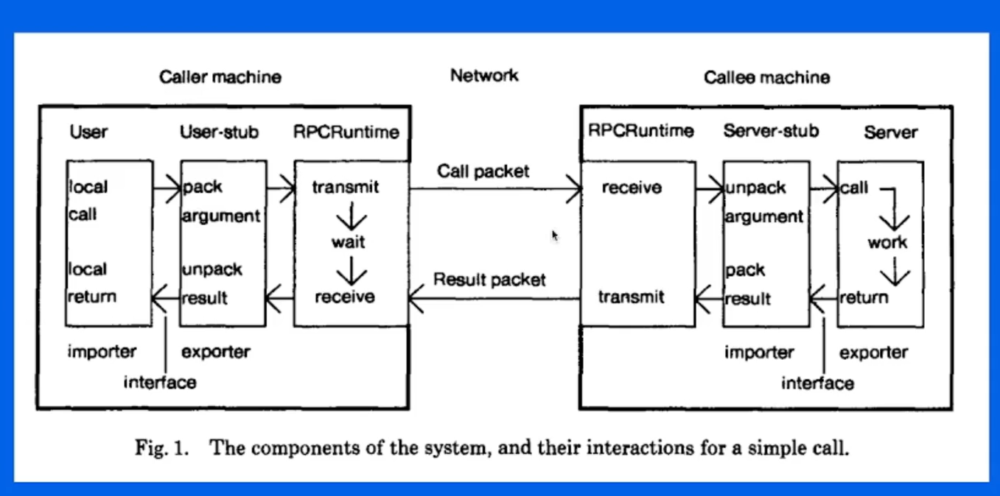
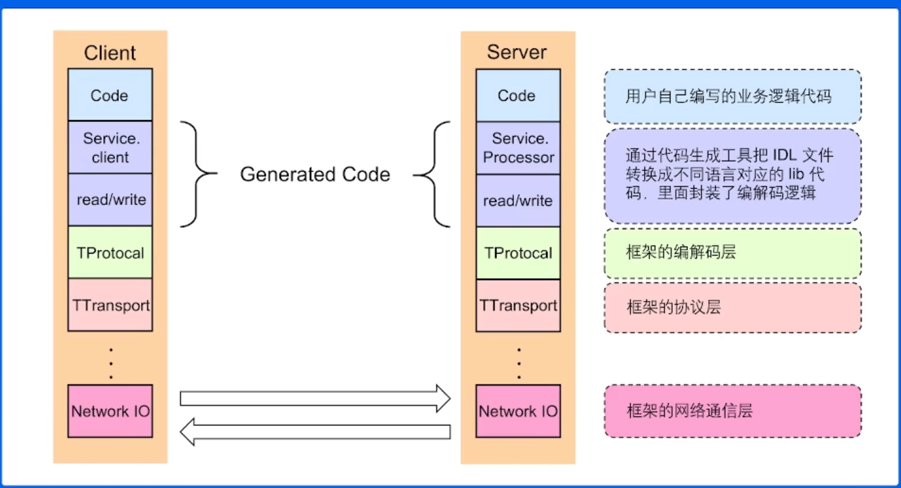

# 深入浅出 RPC 框架 | 青训营笔记

> 这是我参与「第三届青训营 -后端场」笔记创作活动的的第5篇笔记	

[TOC]

## 基本概念

1. 本地函数调用

   > 函数调用的本质就是压栈

2. **远程函数调用**

   RPC需要解决的问题

   1. 函数映射

      使用id查找指定函数 

   2. 数据转换成字节流

   3. 网络传输

3. RPC概念模型

   

4. 一次完整的RPC过程

   调用端通过GenCode生成代码，然后通过编码器把代码变成字节流，通过某个协议（TCP//UDP）传输（传输之前需要将要发送的内容放到 指定的位置，然后进行打包）到被调用端，然后被调用端进行反序列化（解码）

5. RPC的好处

   1. 单一职责，有利于分工协作和运维开发
   2. 可拓展性强，资源使用率更优
   3. 故障隔离，服务的整体可靠性更高

6. RPC带来的问题

   1. 服务器宕机 
   2. 调用过程中网络异常，如何保证消息的可达性
   3. 请求量突增，服务无法及时处理，有哪些应对措施

## 分层设计

1. 例子

   

2. 编解码层的数据格式

   1. 语言特定的格式
   2. 文本格式（例如 json、xml）
   3. 二进制编码（具有跨语言和高性能的特点）

3. 编解码层-二进制编码

4. 协议层

5. 网络通信层-socket API

4. 网络通信层-网络库

## 关键指标

1. 稳定性
   1. 熔断：保护**调用方**，防止因为调用的服务超时而影响 整个链路
   2. 限流：保护**被调用方**，防止被大流量冲跨
   3. 超时控制
2. 请求成功率（也是稳定性的一种表现）
   1. 负载均衡
   2. 重试
3. 易用性
   1. 开箱即用
   2. 周边工具
4. 扩展性
   1. 中间件
   2. 能对接不同的网络库
   3. ……
5. 观测性
   1. log
   2. 内置观测性服务
6. 高效性
   1. 高吞吐
   2. 低延迟（实际应用用，低延时更重要一点）

